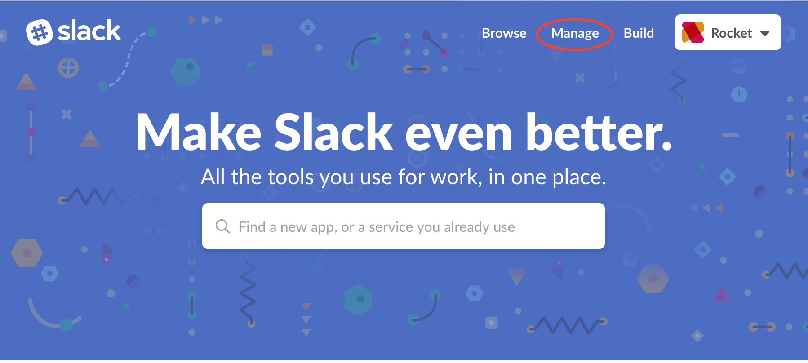
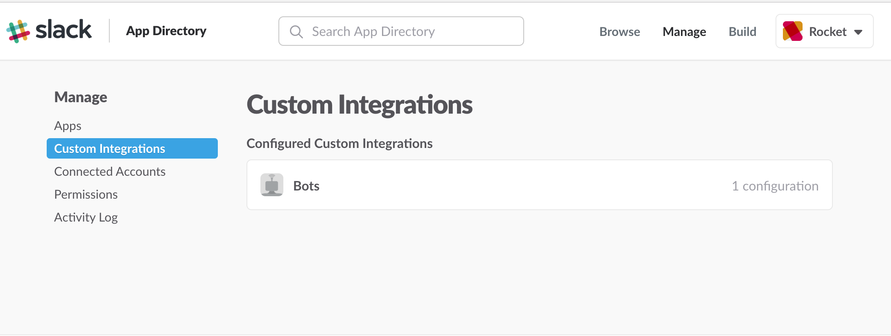
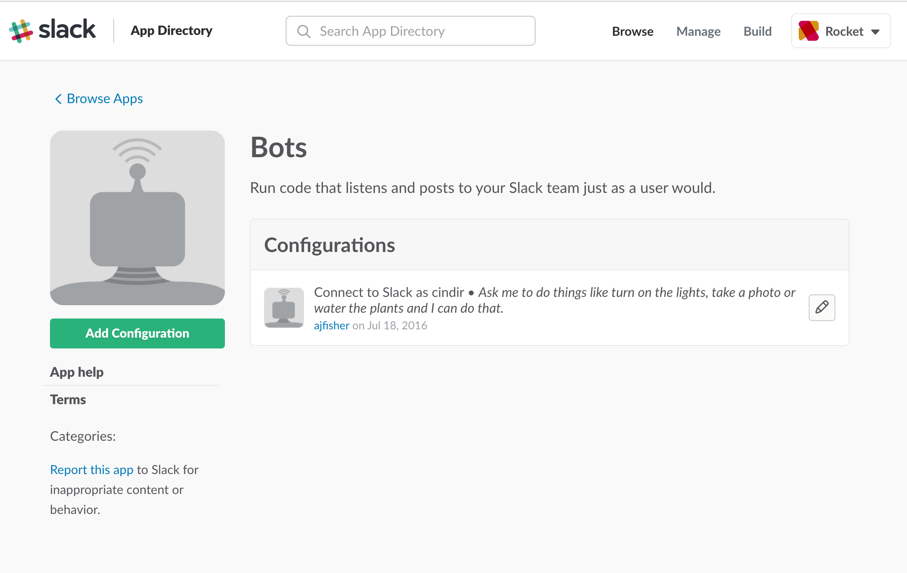
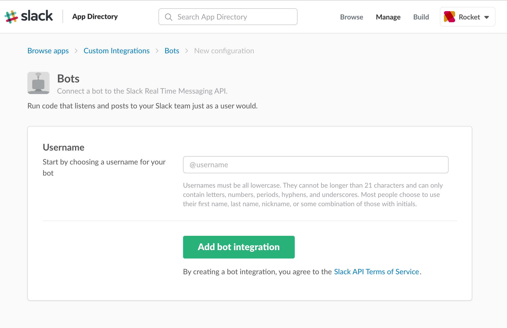

# Building Embodied Bots Workshop - DDD Melbourne 2017

This is the supporting repo for the Building Embodied Bots workshop taking
place at DDD Melbourne, 2017.

This repo is subject to lots of change, so please run regular `git pull` actions
on it to ensure you have the latest code.

## Set up and installation.

### Dependencies

To participate in this workshop you need access to a Slack Team that has at
least one available integration slot and you have admin or team owner access
to be able to create a bot and add it. If you don't have access, then please
[set up a slack team](https://slack.com) so you can set things up.

In addition, you must complete all set up actions for NodeBots as you'll be
dealing with physical hardware. Please see the
[NodeBots AU setup guide](https://github.com/nodebotsau/nbdau/blob/master/setup.md)

#### Other bits to do before hand:

Give your bot a name. Have a look at
[a bot name generator](http://www.fantasynamegenerators.com/robot-names.php)

Want an icon for your bot? Try [RoboHash](https://robohash.org/)

### Repo installation

Clone this repo and install the dependencies

```
git clone https://github.com/ajfisher/embodied-bots.git
cd embodied-bots
npm install
```

This will install the following:

* Johnny Five - Used to talk to hardware
* Node MQTT - used for creating MQTT messaging
* BotKit - framework for creating bots for Slack and FBM.
* plot.ly - framework for making graphs

### Slack Bot configuration

From slack, go to the main menu and then select "Apps and Integrations".

This will launch a web browser to your team management screen, select "Manage"
from the top right menu which you can see below.



Select "Custom Integrations" on the left and you'll see a screen like that below.
Select "Bots"



Now you're on the main integration screen for your new bot or your future stable
of bots. Select the "Add configuration" button.



You'll now need to add a username. Choose something memorable, and easy to type
to call your bot. There's links above to namers if you need some help.



Once done, select "Add bot integration" to add your new bot to your team.

Next you'll land on a screen that will allow you to configure various aspects
of your bot but most importantly, you'll see your `Slack Token` which allows
your Bot to connect to Slack's API and post messages to your team channels.


Drop back into your terminal where you cloned the project and
`cp .env.template .env` - this will give you an environment file and you
then open it up and paste your token into the field called `SLACK_TOKEN`.

Now you're ready to go.

