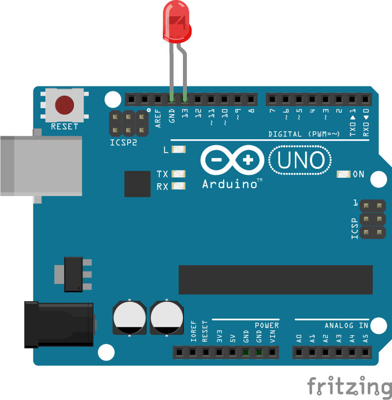

# Hello Hardware World

## Objective

In this exercise we will create a simple blinking LED. This is the
"Hello, World" of hardware as it shows you can undertake both physical and
software control of your device.

## Preparation

### Circuit

Build the circuit below:



### Run the arduino

Plug your arduino into your computer using the USB cable. Again, you should
have completed all setup tasks in the
[setup guide](https://github.com/nodebotsau/nbdau/blob/master/setup.md).

## Install firmata on to your arduino (optional)

The hardware you'll be given will have firmata on it if you're in a workshop.
If not you'll need to do the step below.

From a terminal run:

```
interchange install StandardFirmata -a uno
```

This will flash your board with the Firmata code which allows Node to speak
to it over USB.

## Write or open the example file.

The example code is located in `examples/code/1-blink.js` or you can use the
code below:

```
const dotenv = require('dotenv').config(); // 1
const five = require('johnny-five'); // 1

let board = new five.Board({port: process.argv[2]}); //2

board.on('ready', () => { // 3

    let led = new five.Led(13); // 4

    led.blink(1000); // 5

});

board.on('error', (err) => { // 6
    console.log(err);
    process.exit();
});
```

Code notes:

1. Include the `Johnny Five` framework to work with hardware objects

2. Create a new Johnny Five `Board` instance. As part of it's set up, optionally
pass a port address into it from the command line. Handy for targeting a
specific USB device.

3. The board emits a `ready` event when it's connected and good to go

4. Create a new instance of an `Led` object and attach it to Pin 13 on the arduino

5. `.blink(msec)` is a convenience method that will turn the LED on or off
at a specific interval and keep track of its current state etc.

6. As we're good developers, we always try and catch an error, if there's a
problem then `Board` will emit an `error` event which we can try to handle. In
this case we'll just exit.

## Run the example

You can run the example by executing the following:

```
node examples/code/1-blink.js
```

If you have troubles detecting the Serial port then you can pass in an argument
to direct Johnny Five to a specific port, eg:

```
node examples/code/1-blink.js COM6
```

## Extensions

Explore the LED API further:

* Try different speeds to make the LED blink faster and slower
* Pass the speed in via an argument to make the command more dynamic
* If you're familiar with node, add the LED object to the REPL and interact with
it directly.
* Learn more about the API on the [Johnny Five site](http://johnny-five.io/api/led/)
