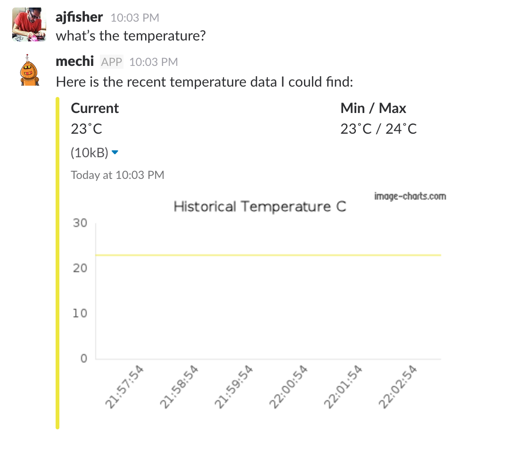

# Bots that can respond to data

## Objective

This exercise begins to flip around the interaction model. Instead of a bot
where you can tell it to do things, the bot is able to answer questions about
the status of something in the world. It will also be able to keep track of
this information.

## Preparation

You will need to make a new circuit. You can leave your LED circuit
up if you want to combine the two but we won't discuss light right now.

### Circuit

In this example you will create a temperature sensor in order to capture
temperature data from the environment. The circuit is shown below:

-- PUT TEMP SENSOR CIRCUIT IN HERE

## Design considerations

In this scenario our setup looks like this:

* The temperature sensor streams temperature data over MQTT at whatever frequency
makes sense.
* The bot captures this information and stores it in a buffer so it has some local
context.
    * This buffer should be of fixed length so memory doesn't run out.
    * We should capture local max and min values as well as the current value
    to do other interesting things.
* We can use the data we have to create charts and add them as attachments to the
bot's replies.
* We also want the bot to have a start up value of the temperature so in this
case we'll use MQTT's `retain` feature. This tells the server to hold onto that
value and is handy when dealing with potentially transient sources. The bot will
then always get at least one value to be able to report from.

## New environment variables

You will need to configure some additional enviroment variables in your `.env`
file as outlined below:

* `TEMP_PIN` - the pin on the arduino you'll be using to get the temperature from.
This will be on an analog pin so should be labelled like `A0`, `A1` etc.
* `TEMP_FREQUENCY` - the number of seconds to wait between sampling & sending
the temperature

## Use the example files

The examples are split up over several files

* `6-temp-server.js` - used to connect the arduino and sample the temperature
data and send it to MQTT server.
* `6-temp-bot.js` - the bot code that responds to the request for temperature
information

### Code notes

1. `6-temp-server.js` is just a data feed. It retrieves the current temperature
value from the arduino and then pushes it to MQTT.

2. `6-temp-bot.js` is stripped back to just the bare bones of how to handle
the data request.

3. `6-get-bot.js:23-40` is the main handler of the incoming data. As you can see
as data arrives, the new item is pushed on the current temperature value and
it is compared to see if the max or min should be updated.

4. `6-temp-bot.js:58-153` comprises the main data handling to generate a png
file. Ordinarily you would do this with your own data service and run it off
your server, however this allows us to use a public API. From there we
construct an attachment (full details are in the file for you to play with)
and finally return it.

## Run the example

As before you'll probably want multiple terminals to do this.

Start by running the temperature server

```
node examples/code/6-temp-server.js
```

You can use the MQTT command line tools to subscribe to your temperature topic
and then see that the data is working. eg:

```
mqtt_sub -h 'test.mosquitto.org' -v -t '<YOUR TOPIC NAME>/temperature/#'
```

If this is working, then you can use your bot to look at this data.

```
node examples/code/6-temp-bot.js
```

Let the data come in for a minute or so and then say to your bot:

`what is the temperature?`

You should get a reply similar to this:



## Going further

* You can persist the data to disk using something like lowdb or other tools.
This can be used to get more statistics for the bot.


